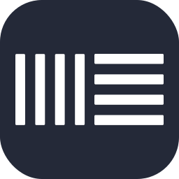

<p align="center"></p>
<p align="center"></p>
<h3 align="center">Your most powerful skills on GitHub 🚀</h3>
<hr>

### ADD ICONS: If you want to add an icon that does not exist in our database, please open an issue and our team will review the request to add

# Summary

- [Example](#example)
- [Select Icons](#select-icons)
- [How Use](#how-use)
- [Examples](#examples)
- [Icons List](#icons-list)


# Example

<p align="center"></p>


# Select Icons
<p align="center"></p>

- **Select you skills:** You need select the skills that you want generate icons
- **Per Line:** Choose how many icons will be rendered per line. (Min: 1 Max: 30)
- **Size:** Choose the size of icons. (default: 48px)
- **Theme:** Choose 'dark' or 'light' theme to render the icons. (default: dark)

# How Use

<p align="center"></p>

After choosing your icons, copy the generated link on the website and use this template below to paste in README.md, on your Github

```md
[](https://devicons.dev.br/)
```
[](https://devicons.dev.br/)

# Examples
- Light Theme:
```md
[](https://devicons.dev.br/)
```
[](https://devicons.dev.br/)
---
- Per Line:
```md
[](https://devicons.dev.br/)
```
[](https://devicons.dev.br/)
---
- Size:
```md
[](https://devicons.dev.br/)
```
[](https://devicons.dev.br/)
---
- Centering Icons:

```html
<p align="center">
  <a href="https://devicons.dev.br/">
    
  </a>
</p>
```
<p align="center">
  <a href="https://devicons.dev.br/">
    
  </a>
</p>

# Icons List
|      Icon ID       |                         Icon                          |      Icon ID       |                         Icon                          |      Icon ID       |                         Icon                          |      Icon ID       |                         Icon                          |
| :----------------: | :---------------------------------------------------: | :----------------: | :---------------------------------------------------: | :----------------: | :---------------------------------------------------: | :----------------: | :---------------------------------------------------: |
|     `ableton`      |        |   `activitypub`    |    |      `actix`       |          |      `adonis`      |         |
|        `ae`        |    |     `aiscript`     |       |     `alpinejs`     |       |  `androidstudio`   |  |
|     `angular`      |        |     `ansible`      |        |      `apollo`      |         |     `appwrite`     |       |
|     `arduino`      |        |      `astro`       |          |       `atom`       |           |        `au`        |       |
|     `autocad`      |        |       `aws`        |            |       `azul`       |           |      `azure`       |          |
|      `babel`       |          |       `bash`       |           |       `bevy`       |           |     `blender`      |        |
|    `bootstrap`     |      |       `bsd`        |            |        `c`         |              |        `cs`        |             |
|       `cpp`        |            |     `crystal`      |        |    `cassandra`     |      |     `clojure`      |        |
|    `cloudflare`    |     |      `cmake`       |          |     `codepen`      |        |   `coffeescript`   |   |
|       `css`        |            |        `d3`        |             |       `dart`       |           |       `deno`       |           |
|      `devto`       |          |     `discord`      |        |       `bots`       |    |      `django`      |         |
|      `docker`      |         |      `dotnet`      |         |     `dynamodb`     |       |     `eclipse`      |        |
|     `electron`     |       |      `elixir`      |         |      `emacs`       |          |      `ember`       |          |
|     `emotion`      |        |     `express`      |      |     `fastapi`      |        |    `fediverse`     |      |
|      `figma`       |          |     `firebase`     |       |      `flask`       |          |     `flutter`      |        |
|      `forth`       |          |     `fortran`      |        | `gamemakerstudio`  |  |      `gatsby`      |         |       `gcp`        |            |       `git`        |            |
|      `github`      |         |  `githubactions`   |  |      `gitlab`      |         |     `gherkin`      |        |
|        `go`        |         |      `gradle`      |         |      `godot`       |          |     `grafana`      |        |
|     `graphql`      |        |       `gtk`        |            |       `gulp`       |           |     `haskell`      |        |
|       `haxe`       |           |    `haxeflixel`    |     |      `heroku`      |         |    `hibernate`     |      |
|       `html`       |           |       `idea`       |           |        `ai`        |    |    `instagram`     |      |
|       `ipfs`       |           |       `java`       |           |        `js`        |     |     `jenkins`      |        |
|       `jest`       |           |      `jquery`      |         |      `kafka`       |          |      `kotlin`      |         |
|       `ktor`       |           |    `kubernetes`    |     |     `laravel`      |        |      `latex`       |          |
|     `linkedin`     |       |      `linux`       |          |       `lit`        |            |       `lua`        |            |
|        `md`        |       |     `mastodon`     |       |    `materialui`    |     |      `matlab`      |         |
|      `maven`       |          |     `misskey`      |        |     `mongodb`      |        |      `mysql`       |          |
|      `neovim`      |         |      `nestjs`      |         |     `netlify`      |        |      `nextjs`      |         |
|      `nginx`       |          |       `nim`        |            |      `nodejs`      |         |      `nuxtjs`      |         |
|      `ocaml`       |          |      `octave`      |         |    `openshift`     |      |    `openstack`     |      |
|       `perl`       |           |        `ps`        |      |       `php`        |            |      `plan9`       |          |
|   `planetscale`    |    |     `postgres`     |     |     `postman`      |        |    `powershell`    |     |
|        `pr`        |       |      `prisma`      |         |    `processing`    |     |    `prometheus`    |     |
|       `pug`        |            |        `py`        |         |     `pytorch`      |        |        `qt`        |             |
|        `r`         |              |     `rabbitmq`     |       |      `rails`       |          |   `raspberrypi`    |    |
|      `react`       |          |    `reactivex`     |      |      `redis`       |          |      `redux`       |          |
|      `regex`       |          |      `remix`       |          |      `replit`      |         |      `rocket`      |         |
|     `rollupjs`     |       |       `ros`        |            |       `ruby`       |           |       `rust`       |           |
|       `sass`       |           |      `spring`      |         |      `sqlite`      |         |  `stackoverflow`   |  |
| `styledcomponents` |  |     `supabase`     |       |      `scala`       |          |     `selenium`     |       |
|      `sentry`      |         |    `sequelize`     |      |     `sketchup`     |       |     `solidity`     |       |
|     `solidjs`      |        |      `svelte`      |         |       `svg`        |            |      `swift`       |          |
|     `symfony`      |        |     `tailwind`     |    |      `tauri`       |          |    `tensorflow`    |     |
|     `threejs`      |        |     `twitter`      |        |        `ts`        |     |      `unity`       |          |
|      `unreal`      |    |        `v`         |              |       `vala`       |           |      `vercel`      |         |
|       `vim`        |            |   `visualstudio`   |   |       `vite`       |           |      `vscode`      |         |
|       `vue`        |          |       `wasm`       |    |     `webflow`      |        |     `webpack`      |        |
|     `windicss`     |       |    `wordpress`     |      |     `workers`      |        |        `xd`        |             |
|       `zig`        |            |
