<p align="center"></p>
<p align="center"></p>
<h3 align="center">Your most powerful skills on GitHub 🚀</h3>
<hr>

### ADD ICONS: If you want to add an icon that does not exist in our database, please open an issue and our team will review the request to add

# Summary

- [Example](#example)
- [Select Icons](#select-icons)
- [How Use](#how-use)
- [Examples](#examples)
- [Icons List](#icons-list)


# Example

<p align="center"></p>


# Select Icons
<p align="center"></p>

- **Select you skills:** You need select the skills that you want generate icons
- **Per Line:** Choose how many icons will be rendered per line. (Min: 1 Max: 30)
- **Size:** Choose the size of icons. (default: 48px)
- **Theme:** Choose 'dark' or 'light' theme to render the icons. (default: dark)

# How Use

<p align="center"></p>

After choosing your icons, copy the generated link on the website and use this template below to paste in README.md, on your Github

```md
[](https://devicons.dev.br/)
```
[](https://devicons.dev.br/)

# Examples
- Light Theme:
```md
[](https://devicons.dev.br/)
```
[](https://devicons.dev.br/)
---
- Per Line:
```md
[](https://devicons.dev.br/)
```
[](https://devicons.dev.br/)
---
- Size:
```md
[](https://devicons.dev.br/)
```
[](https://devicons.dev.br/)
---
- Centering Icons:

```html
<p align="center">
  <a href="https://devicons.dev.br/">
    
  </a>
</p>
```
<p align="center">
  <a href="https://devicons.dev.br/">
    
  </a>
</p>

# Icons List
| Icon ID | Icon | Icon ID | Icon | Icon ID | Icon |
|---------|------|---------|------|---------|------|
| `ableton-dark` |  | `activitypub-dark` |  | `actix-dark` | |
| `adonis` |  | `aftereffects` |  | `aiscript-dark` | |
| `alpinejs-dark` |  | `anaconda-dark` |  | `androidstudio-dark` | |
| `angular-dark` |  | `ansible` |  | `apollo` | |
| `apple-dark` |  | `appwrite` |  | `arch-dark` | |
| `arduino` |  | `astro` |  | `atom` | |
| `audition` |  | `autocad-dark` |  | `aws-dark` | |
| `azul` |  | `azure-dark` |  | `babel` | 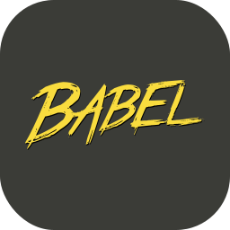|
| `bash-dark` |  | `bevy-dark` | 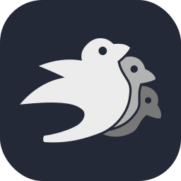 | `bitbucket-dark` | |
| `blender-dark` |  | `bootstrap` |  | `bsd-dark` | |
| `bun-dark` |  | `c` |  | `cassandra-dark` | |
| `clion-dark` |  | `clojure-dark` |  | `cloudflare-dark` | |
| `cmake-dark` |  | `codepen-dark` |  | `coffeescript-dark` | |
| `cpp` |  | `crystal-dark` | 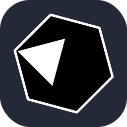 | `cs` | |
| `css` |  | `cypress-dark` |  | `d3-dark` | |
| `dart-dark` |  | `debian-dark` |  | `deno-dark` | |
| `devto-dark` |  | `discord` |  | `discordbots` | |
| `discordjs-dark` |  | `django` |  | `docker` | |
| `dotnet` |  | `dynamodb-dark` |  | `eclipse-dark` | |
| `elasticsearch-dark` |  | `electron` |  | `elixir-dark` | |
| `elysia-dark` |  | `emacs` |  | `ember` | |
| `emotion-dark` |  | `expressjs-dark` |  | `fastapi` | |
| `fediverse-dark` |  | `figma-dark` |  | `firebase-dark` | |
| `flask-dark` |  | `flutter-dark` |  | `forth` | |
| `fortran` |  | `gamemakerstudio` |  | `gatsby` | |
| `gcp-dark` |  | `gherkin-dark` |  | `git` | |
| `github-dark` |  | `githubactions-dark` |  | `gitlab-dark` | |
| `gmail-dark` |  | `godot-dark` |  | `golang` | |
| `gradle-dark` |  | `grafana-dark` |  | `graphql-dark` | |
| `gtk-dark` |  | `gulp` |  | `haskell-dark` | |
| `haxe-dark` |  | `haxeflixel-dark` |  | `heroku` | |
| `hibernate-dark` |  | `html` |  | `htmx-dark` | |
| `idea-dark` |  | `illustrator` |  | `instagram` | |
| `ipfs-dark` |  | `java-dark` |  | `javascript` | |
| `jenkins-dark` |  | `jest` |  | `jquery` | |
| `julia-dark` | 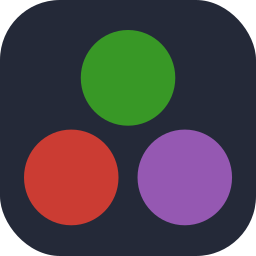 | `kafka` |  | `kali-dark` | |
| `kotlin-dark` |  | `ktor-dark` |  | `kubernetes` | |
| `laravel-dark` |  | `latex-dark` |  | `less-dark` | |
| `linkedin` |  | `linux-dark` |  | `lit-dark` | |
| `lua-dark` |  | `markdown-dark` |  | `mastodon-dark` | |
| `materialui-dark` |  | `matlab-dark` |  | `maven-dark` | |
| `mint-dark` |  | `misskey-dark` |  | `mongodb` | |
| `mysql-dark` |  | `neovim-dark` |  | `nestjs-dark` | |
| `netlify-dark` |  | `nextjs-dark` |  | `nginx` | |
| `nim-dark` |  | `nix-dark` | 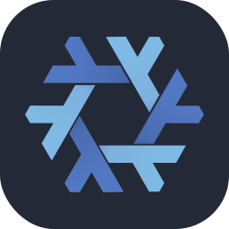 | `nodejs-dark` | |
| `notion-dark` |  | `npm-dark` |  | `nuxtjs-dark` | |
| `obsidian-dark` |  | `ocaml` |  | `octave-dark` | |
| `opencv-dark` |  | `openshift` |  | `openstack-dark` | |
| `p5js` |  | `perl` |  | `photoshop` | |
| `php-dark` |  | `phpstorm-dark` | 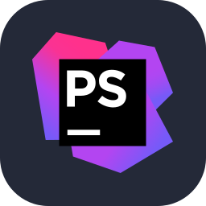 | `pinia-dark` | |
| `pkl-dark` | 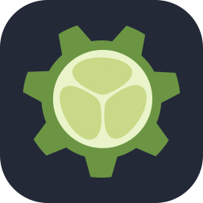 | `plan9-dark` |  | `planetscale-dark` | |
| `pnpm-dark` |  | `postgresql-dark` |  | `postman` | |
| `powershell-dark` |  | `premiere` |  | `prisma` | |
| `processing-dark` |  | `prometheus` |  | `pug-dark` | |
| `pycharm-dark` |  | `python-dark` |  | `pytorch-dark` | |
| `qt-dark` |  | `r-dark` |  | `rabbitmq-dark` | |
| `rails` |  | `raspberrypi-dark` |  | `react-dark` | |
| `reactivex-dark` |  | `redhat-dark` |  | `redis-dark` | |
| `redux` |  | `regex-dark` |  | `remix-dark` | |
| `replit-dark` |  | `rider-dark` |  | `robloxstudio` | |
| `rocket` |  | `rollupjs-dark` |  | `ros-dark` | |
| `ruby` |  | `rust` | 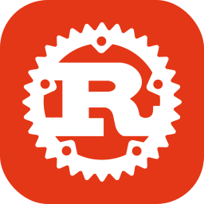 | `sass` | |
| `scala-dark` |  | `scikitlearn-dark` |  | `selenium` | |
| `sentry` |  | `sequelize-dark` | 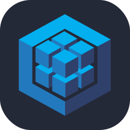 | `sketchup-dark` | |
| `solidity` |  | `solidjs-dark` | 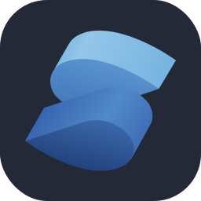 | `spring-dark` | |
| `sqlite` |  | `stackoverflow-dark` |  | `styledcomponents` | |
| `sublime-dark` |  | `supabase-dark` |  | `svelte` | |
| `svg-dark` |  | `swift` |  | `symfony-dark` | |
| `tailwindcss-dark` |  | `tauri-dark` |  | `tensorflow-dark` | |
| `terraform-dark` |  | `threejs-dark` |  | `twitter` | |
| `typescript` |  | `ubuntu-dark` |  | `unity-dark` | |
| `unrealengine` |  | `v-dark` |  | `vala` | |
| `vercel-dark` | 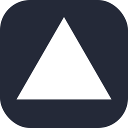 | `vim-dark` |  | `visualstudio-dark` | |
| `vite-dark` |  | `vitest-dark` |  | `vscode-dark` | |
| `vscodium-dark` |  | `vuejs-dark` |  | `vuetify-dark` | |
| `webassembly` |  | `webflow` |  | `webpack-dark` | |
| `webstorm-dark` |  | `windicss-dark` |  | `windows-dark` | |
| `wordpress` |  | `workers-dark` |  | `xd` | |
| `yarn-dark` | 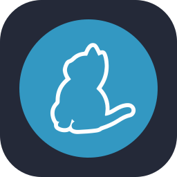 | `yew-dark` |  | `zig-dark` | |
