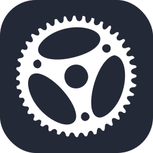
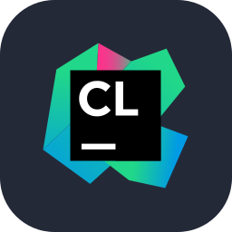
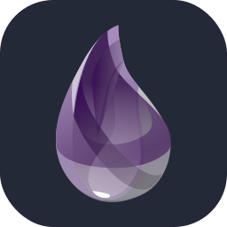
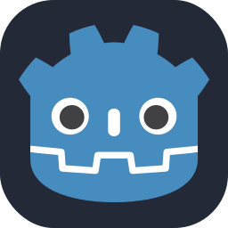
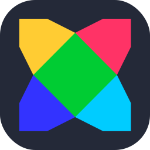
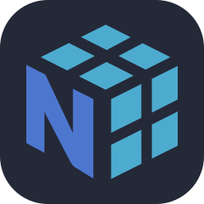
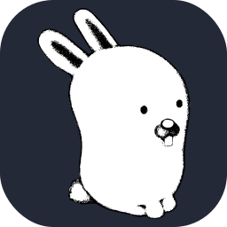
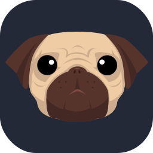
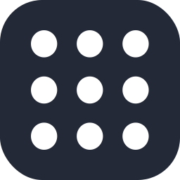
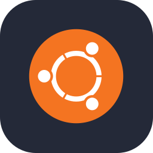

<p align="center"></p>
<p align="center"></p>
<h3 align="center">Your most powerful skills on GitHub 🚀</h3>
<hr>

### ADD ICONS: If you want to add an icon that does not exist in our database, please open an issue and our team will review the request to add

# Summary

- [Example](#example)
- [Select Icons](#select-icons)
- [How Use](#how-use)
- [Examples](#examples)
- [Icons List](#icons-list)


# Example

<p align="center"></p>


# Select Icons
<p align="center"></p>

- **Select you skills:** You need select the skills that you want generate icons
- **Per Line:** Choose how many icons will be rendered per line. (Min: 1 Max: 30)
- **Size:** Choose the size of icons. (default: 48px)
- **Theme:** Choose 'dark' or 'light' theme to render the icons. (default: dark)

# How Use

<p align="center"></p>

After choosing your icons, copy the generated link on the website and use this template below to paste in README.md, on your Github

```md
[](https://devicons.dev.br/)
```
[](https://devicons.dev.br/)

# Examples
- Light Theme:
```md
[](https://devicons.dev.br/)
```
[](https://devicons.dev.br/)
---
- Per Line:
```md
[](https://devicons.dev.br/)
```
[](https://devicons.dev.br/)
---
- Size:
```md
[](https://devicons.dev.br/)
```
[](https://devicons.dev.br/)
---
- Centering Icons:

```html
<p align="center">
  <a href="https://devicons.dev.br/">
    
  </a>
</p>
```
<p align="center">
  <a href="https://devicons.dev.br/">
    
  </a>
</p>

# Icons List
| Icon ID | Icon | Icon ID | Icon | Icon ID | Icon |
|---------|------|---------|------|---------|------|
| `ableton` |  | `activitypub` |  | `actix` | |
| `adonis` |  | `aftereffects` |  | `aiscript` | |
| `alpinejs` |  | `anaconda` |  | `androidstudio` | |
| `angular` |  | `ansible` |  | `apollo` | |
| `apple` |  | `appwrite` |  | `arch` | |
| `arduino` |  | `astro` |  | `atom` | |
| `audition` |  | `autocad` |  | `aws` | |
| `azul` |  | `azure` |  | `babel` | |
| `bash` |  | `bevy` |  | `bitbucket` | |
| `blender` |  | `bootstrap` |  | `bsd` | |
| `bun` |  | `c` |  | `cassandra` | |
| `clion` |  | `clojure` |  | `cloudflare` | |
| `cmake` |  | `codepen` |  | `coffeescript` | |
| `cpp` |  | `crystal` |  | `cs` | |
| `css` |  | `cypress` |  | `d3` | |
| `dart` |  | `datadog` |  | `debian` | |
| `deno` |  | `devto` |  | `discord` | |
| `discordbots` |  | `discordjs` |  | `django` | |
| `docker` |  | `dotnet` |  | `dynamodb` | |
| `eclipse` |  | `elasticsearch` |  | `electron` | |
| `elixir` |  | `elysia` |  | `emacs` | |
| `ember` |  | `emotion` |  | `expressjs` | |
| `fastapi` |  | `fediverse` |  | `figma` | |
| `firebase` |  | `flask` |  | `flutter` | |
| `forth` |  | `fortran` |  | `gamemakerstudio` | |
| `gatsby` |  | `gcp` |  | `gherkin` | |
| `git` |  | `github` |  | `githubactions` | |
| `gitlab` |  | `gmail` |  | `godot` | |
| `golang` |  | `gradio` |  | `gradle` | |
| `grafana` |  | `graphql` |  | `gtk` | |
| `gulp` |  | `haskell` |  | `haxe` | |
| `haxeflixel` |  | `heroku` |  | `hibernate` | |
| `html` |  | `htmx` |  | `idea` | |
| `illustrator` |  | `indesign` |  | `instagram` | |
| `ipfs` |  | `java` |  | `javascript` | |
| `jenkins` |  | `jest` |  | `jira` | |
| `jquery` |  | `julia` |  | `kafka` | |
| `kali` |  | `kotlin` |  | `ktor` | |
| `kubernetes` |  | `laravel` |  | `latex` | |
| `less` |  | `linkedin` |  | `linux` | |
| `lit` |  | `lua` |  | `mariadb` | |
| `markdown` |  | `mastodon` |  | `materialui` | |
| `matlab` |  | `matplotlib` |  | `maven` | |
| `mint` |  | `misskey` |  | `mongodb` | |
| `mssql` |  | `mysql` |  | `neovim` | |
| `nestjs` |  | `netlify` |  | `nextjs` | |
| `nginx` |  | `nim` |  | `nix` | |
| `nodejs` |  | `notion` |  | `npm` | |
| `numpy` |  | `nuxtjs` |  | `obsidian` | |
| `ocaml` |  | `octave` |  | `opencv` | |
| `openshift` |  | `openstack` |  | `oracle` | |
| `p5js` |  | `pandas` |  | `perl` | |
| `photoshop` |  | `php` |  | `phpstorm` | |
| `pinia` |  | `pkl` |  | `plan9` | |
| `planetscale` |  | `playwright` |  | `pnpm` | |
| `postgresql` |  | `postman` |  | `powershell` | |
| `premiere` |  | `prisma` |  | `processing` | |
| `prometheus` |  | `pug` |  | `puppeteer` | |
| `pycharm` |  | `python` |  | `pytorch` | |
| `qt` |  | `r` |  | `rabbitmq` | |
| `rails` |  | `raspberrypi` |  | `react` | |
| `reactivex` |  | `reactquery` |  | `redhat` | |
| `redis` |  | `redux` |  | `regex` | |
| `remix` |  | `replit` |  | `rider` | |
| `robloxstudio` |  | `rocket` |  | `rollupjs` | |
| `ros` |  | `ruby` |  | `rust` | |
| `sass` |  | `scala` |  | `scikitlearn` | |
| `selenium` |  | `sentry` |  | `sequelize` | |
| `sketchup` |  | `slack` |  | `solidity` | |
| `solidjs` |  | `spring` |  | `sqlite` | |
| `stackoverflow` |  | `streamlit` |  | `styledcomponents` | |
| `sublime` |  | `supabase` |  | `svelte` | |
| `svg` |  | `swift` |  | `symfony` | |
| `tailwindcss` |  | `tauri` |  | `tensorflow` | |
| `terraform` |  | `threejs` |  | `twitter` | |
| `typescript` |  | `ubuntu` |  | `unity` | |
| `unrealengine` |  | `v` |  | `vala` | |
| `vercel` |  | `vim` |  | `visualstudio` | |
| `vite` |  | `vitest` |  | `vscode` | |
| `vscodium` |  | `vuejs` |  | `vuetify` | |
| `webassembly` |  | `webflow` |  | `webpack` | |
| `webstorm` |  | `windicss` |  | `windows` | |
| `wordpress` |  | `workers` |  | `x` | |
| `xd` |  | `yaml` |  | `yarn` | |
| `yew` |  | `zabbix` |  | `zig` | |
